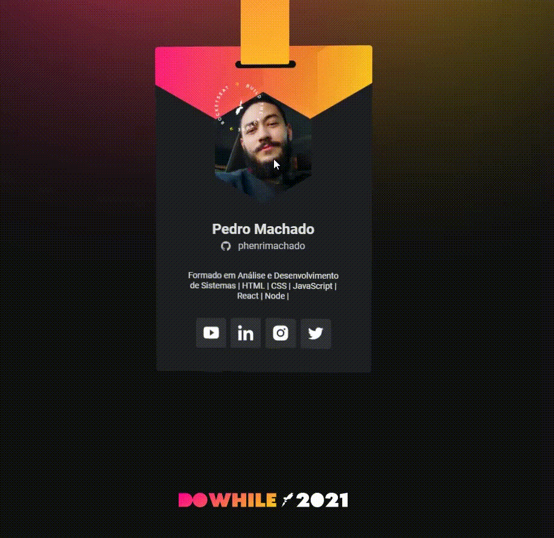

<h1 align="center">
  
</h1>

<h2 align="center">🚀 Badge Do While 2021 - Subscribe to <a href="https://dowhile.io/inscricao">DoWhile 2021</a></h2>

  <a href="#why">Why</a> •
  <a href="#tech-stack">Tech Stack</a> •
  <a href="#about-me">About Me</a>

  

 

<h2 id="why">😊 Why?</h2>

This project was created by Rocketseat Boosters and featured at NLW Heat, Rocketseat's latest NLW of this year. The project presented in this repository was created on the Origin track, where initial points of HTML, CSS and JavaScript were given to beginners or those who wanted to reinforce this theoretical and technical knowledge.

The initial project is completely static and unresponsive to several devices and was a challenge, a more personal styling and the application of responsiveness. I used the Vanilla Tilt library to add movement to the badge and CSS for the rest of the animations.

<h2 id="tech-stack">⚡ Tech Stack</h2>
<ul>
  <li><a href="https://developer.mozilla.org/en-US/docs/Web/HTML">HTML</a></li>
  <li><a href="https://developer.mozilla.org/en-US/docs/Web/CSS">CSS</a></li>
  <li><a href="https://developer.mozilla.org/en-US/docs/Web/JavaScript/Reference">JavaScript</a></li>
  <li><a href="https://micku7zu.github.io/vanilla-tilt.js/">Vanilla Tilt</a></li>
</ul>

<h2 id="about-me">🧒🏻 About me</h2>

My name is Pedro Henrique, I'm 23 years old and I have a degree in systems development. Born in Brazil, I seek my entry into the work area as a developer, especially using JavaScript as a language. Currently, I have focused on better understanding more advanced concepts of HTML and CSS and also starting my studies with the Stack of NodeJS and ReactJS.
